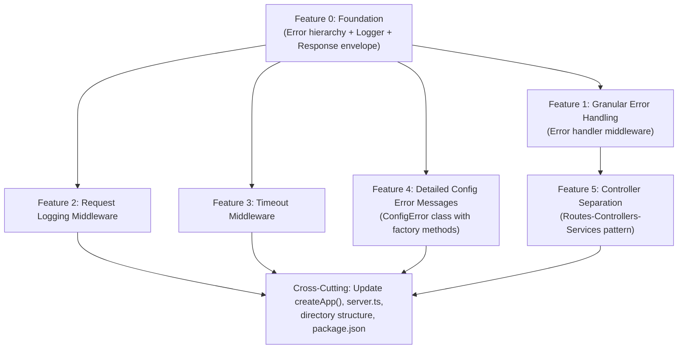

# Implementation Plan: Update `create-api-base` Skill with 5 Production Features

**Date**: 2026-02-23
**Target file**: `/Users/giorgosmarinos/.claude/skills/create-api-base/01-model-api-option.md`
**Source investigation**: `api-base-skill-update/01-investigation-notes.md`
**Deviation analysis**: `docs/design/api-skill-deviation-analysis.md`

---

## Executive Summary

This plan details the precise modifications required to update the `01-model-api-option.md` skill file with five production-quality features extracted and generalized from the azure-fs REST API implementation. Each feature is presented as a self-contained changeset with exact insertion points referenced by section number and title in the current skill file.

The five features are:

1. **Granular Error Handling** -- Centralized error handler with typed error hierarchy, HTTP status mapping, message sanitization, and standardized error envelope.
2. **Request Logging Middleware** -- Factory-function middleware with Logger dependency injection, per-request timing, and `METHOD URL -> STATUS (DURATIONms)` log format.
3. **Timeout Middleware** -- Per-request configurable timeout with HTTP 408 response, factory pattern, and cleanup on `finish`/`close` events.
4. **Detailed Config Error Messages** -- `ConfigError.missingRequired()` and `ConfigError.invalidValue()` factory methods that provide remediation guidance showing all configuration sources.
5. **Controller Separation** -- Routes-Controllers-Services three-layer pattern with factory functions, DI, shared `buildResponse()` utility, and centralized route registration.

**Estimated total additions**: ~800 lines of new/modified content in the skill file.

**What will NOT change**: Container-aware Swagger URLs, Port Checker utility, Development routes, Feature flags, EnvironmentManager/AppConfigurationManager class structure (only the validation error format changes).

---

## Implementation Order and Dependency Diagram



**Implementation sequence**:

| Step | Feature | Rationale |
|------|---------|-----------|
| 1 | Feature 0: Foundation (Error hierarchy + Logger + Response envelope) | All other features depend on `AppError`, `Logger`, and the response envelope types |
| 2 | Feature 4: Detailed Config Error Messages | Modifies the existing `EnvironmentManager.validateConfiguration()` to use `ConfigError` factory methods; must be done before the error handler references `ConfigError` |
| 3 | Feature 1: Granular Error Handling | Requires the error hierarchy from Step 1 and `ConfigError` from Step 2 |
| 4 | Feature 2: Request Logging Middleware | Independent; depends only on `Logger` from Step 1 |
| 5 | Feature 3: Timeout Middleware | Independent; uses the response envelope pattern from Step 1 |
| 6 | Feature 5: Controller Separation | Restructures routes to use controllers; depends on error handler being in place (Step 3) |
| 7 | Cross-Cutting Updates | Updates `createApp()`, `server.ts`, directory structure, diagrams, package.json |

---

## Detailed Steps

### Step 1: Foundation -- Error Hierarchy, Logger, Response Envelope

This step creates the shared infrastructure that all five features depend on.

#### 1.1 New Section: "Error Hierarchy" (Insert AFTER current Section 9 "Create Error Handler")

**Current skill file location**: Section 9 (line ~1035, `### 9. Create Error Handler`)

**Action**: Replace the entire Section 9 content with an expanded version. The current section is 22 lines of simple error handler code. It will be replaced with the full error hierarchy plus the improved error handler middleware.

**New files to define**:

**`src/errors/base.error.ts`** -- Generic base error class:

```typescript
export class AppError extends Error {
  constructor(
    public readonly code: string,
    message: string,
    public readonly statusCode?: number,
    public readonly details?: unknown,
  ) {
    super(message);
    this.name = this.constructor.name;
    Object.setPrototypeOf(this, new.target.prototype);
  }

  toJSON(): { code: string; message: string; details?: unknown } {
    return {
      code: this.code,
      message: this.message,
      details: this.details,
    };
  }
}
```

**`src/errors/config.error.ts`** -- Configuration error with factory methods (covered in Step 2).

**`src/errors/auth.error.ts`** -- Authentication error:

```typescript
import { AppError } from './base.error';

export class AuthError extends AppError {
  constructor(code: string, message: string, details?: unknown) {
    super(code, message, 500, details);
  }

  static accessDenied(message?: string): AuthError {
    return new AuthError(
      'AUTH_ACCESS_DENIED',
      message || 'Access denied. Check your credentials and permissions.',
    );
  }

  static connectionFailed(originalError?: Error): AuthError {
    return new AuthError(
      'AUTH_CONNECTION_FAILED',
      'Failed to connect to the authentication provider.',
      originalError ? { originalMessage: originalError.message } : undefined,
    );
  }
}
```

**`src/errors/not-found.error.ts`** -- Generic resource not found:

```typescript
import { AppError } from './base.error';

export class NotFoundError extends AppError {
  constructor(resourceType: string, identifier: string) {
    super(
      'RESOURCE_NOT_FOUND',
      `${resourceType} not found: ${identifier}`,
      404,
      { resourceType, identifier },
    );
  }
}
```

**`src/errors/validation.error.ts`** -- Input validation error:

```typescript
import { AppError } from './base.error';

export class ValidationError extends AppError {
  constructor(message: string, details?: unknown) {
    super('VALIDATION_ERROR', message, 400, details);
  }
}
```

**`src/errors/conflict.error.ts`** -- Concurrency/conflict error:

```typescript
import { AppError } from './base.error';

export class ConflictError extends AppError {
  constructor(message: string, details?: unknown) {
    super('CONFLICT', message, 409, details);
  }
}
```

**`src/errors/index.ts`** -- Barrel export:

```typescript
export { AppError } from './base.error';
export { ConfigError } from './config.error';
export { AuthError } from './auth.error';
export { NotFoundError } from './not-found.error';
export { ValidationError } from './validation.error';
export { ConflictError } from './conflict.error';
```

#### 1.2 New Section: "Logger Utility" (Insert AFTER the new Error Hierarchy section)

**New file**: `src/utils/logger.ts`

```typescript
export type LogLevel = 'debug' | 'info' | 'warn' | 'error';

const LOG_LEVELS: Record<LogLevel, number> = {
  debug: 0,
  info: 1,
  warn: 2,
  error: 3,
};

export class Logger {
  private levelValue: number;

  constructor(private level: LogLevel = 'info') {
    this.levelValue = LOG_LEVELS[level];
  }

  debug(message: string, context?: Record<string, unknown>): void {
    this.log('debug', message, context);
  }

  info(message: string, context?: Record<string, unknown>): void {
    this.log('info', message, context);
  }

  warn(message: string, context?: Record<string, unknown>): void {
    this.log('warn', message, context);
  }

  error(message: string, context?: Record<string, unknown>): void {
    this.log('error', message, context);
  }

  private log(level: LogLevel, message: string, context?: Record<string, unknown>): void {
    if (LOG_LEVELS[level] < this.levelValue) return;
    const timestamp = new Date().toISOString();
    const contextStr = context ? ' ' + JSON.stringify(context) : '';
    process.stderr.write(`[${timestamp}] [${level.toUpperCase()}] ${message}${contextStr}\n`);
  }
}

export class NullLogger extends Logger {
  constructor() { super('error'); }
  debug(): void {}
  info(): void {}
  warn(): void {}
  error(): void {}
}
```

#### 1.3 New Section: "Response Envelope Utilities" (Insert AFTER Logger section)

**New file**: `src/utils/response.ts`

```typescript
export interface SuccessResponse<T> {
  success: true;
  data: T;
  metadata: {
    command: string;
    timestamp: string;
    durationMs: number;
  };
}

export interface ErrorResponse {
  success: false;
  error: {
    code: string;
    message: string;
    details?: unknown;
  };
  metadata: {
    timestamp: string;
  };
}

export function buildSuccessResponse<T>(
  command: string,
  data: T,
  startTime: number,
): SuccessResponse<T> {
  return {
    success: true,
    data,
    metadata: {
      command,
      timestamp: new Date().toISOString(),
      durationMs: Date.now() - startTime,
    },
  };
}

export function buildErrorResponse(
  code: string,
  message: string,
  details?: unknown,
): ErrorResponse {
  return {
    success: false,
    error: { code, message, ...(details !== undefined ? { details } : {}) },
    metadata: { timestamp: new Date().toISOString() },
  };
}
```

#### 1.4 New environment variable

Add to the "Required Environment Variables" section:

```bash
LOG_LEVEL                   # Log level: debug, info, warn, error
```

---

### Step 2: Feature 4 -- Detailed Config Error Messages

#### 2.1 New file: `src/errors/config.error.ts`

**Insert as part of the Error Hierarchy section (Step 1)**:

```typescript
import { AppError } from './base.error';

export class ConfigError extends AppError {
  constructor(code: string, message: string, details?: unknown) {
    super(code, message, undefined, details);
  }

  static missingRequired(
    paramName: string,
    envVarHint: string,
    configFileHint: string,
    initCommandHint?: string,
  ): ConfigError {
    let message =
      `Missing required configuration: ${paramName}\n\n` +
      `Provide it via one of the following methods:\n` +
      `  - Environment var:   ${envVarHint}\n` +
      `  - Config file:       ${configFileHint}\n`;

    if (initCommandHint) {
      message += `\nRun '${initCommandHint}' to create a configuration file interactively.`;
    }

    return new ConfigError('CONFIG_MISSING_REQUIRED', message, { paramName });
  }

  static invalidValue(
    paramName: string,
    value: unknown,
    allowedValues?: string[],
  ): ConfigError {
    let message = `Invalid configuration value for ${paramName}: "${value}"`;
    if (allowedValues && allowedValues.length > 0) {
      message += `\nAllowed values: ${allowedValues.join(', ')}`;
    }
    return new ConfigError('CONFIG_INVALID_VALUE', message, {
      paramName,
      value,
      allowedValues,
    });
  }
}
```

#### 2.2 Modify Section 1: EnvironmentManager `validateConfiguration()`

**Current skill file location**: Section 1 (line ~399, inside `EnvironmentManager.validateConfiguration()`)

**Current code** (to be replaced):

```typescript
validateConfiguration(): void {
    const required = [
      'NODE_ENV', 'PORT', 'HOST', 'CORS_ORIGIN'
    ];

    const missing: string[] = [];

    required.forEach(key => {
      if (!process.env[key]) {
        missing.push(key);
      }
    });

    if (missing.length > 0) {
      throw new Error(`Missing required environment variables: ${missing.join(', ')}`);
    }

    // Validate PORT
    const port = parseInt(process.env.PORT!, 10);
    if (isNaN(port) || port < 1 || port > 65535) {
      throw new Error('PORT must be a number between 1 and 65535');
    }

    console.log(chalk.green('  Configuration validated successfully'));
  }
```

**New code**:

```typescript
validateConfiguration(): void {
    // Each required variable provides remediation guidance
    if (!process.env.NODE_ENV) {
      throw ConfigError.missingRequired(
        'NODE_ENV',
        'export NODE_ENV=development',
        '(set NODE_ENV in your .env file)',
      );
    }

    if (!process.env.PORT) {
      throw ConfigError.missingRequired(
        'PORT',
        'export PORT=3000',
        '(set PORT in your .env file)',
      );
    }

    if (!process.env.HOST) {
      throw ConfigError.missingRequired(
        'HOST',
        'export HOST=localhost',
        '(set HOST in your .env file)',
      );
    }

    if (!process.env.CORS_ORIGIN) {
      throw ConfigError.missingRequired(
        'CORS_ORIGIN',
        'export CORS_ORIGIN=http://localhost:3000',
        '(set CORS_ORIGIN in your .env file)',
      );
    }

    // Validate PORT range
    const port = parseInt(process.env.PORT!, 10);
    if (isNaN(port) || port < 1 || port > 65535) {
      throw ConfigError.invalidValue('PORT', process.env.PORT, [
        'integer between 1 and 65535',
      ]);
    }

    // Validate LOG_LEVEL if provided
    if (process.env.LOG_LEVEL) {
      const validLevels = ['debug', 'info', 'warn', 'error'];
      if (!validLevels.includes(process.env.LOG_LEVEL)) {
        throw ConfigError.invalidValue('LOG_LEVEL', process.env.LOG_LEVEL, validLevels);
      }
    }

    console.log(chalk.green('  Configuration validated successfully'));
  }
```

**Add import** at the top of `EnvironmentManager.ts`:

```typescript
import { ConfigError } from '../errors/config.error';
```

#### 2.3 Modify Section 2: AppConfigurationManager `validateRequiredConfigs()`

**Current skill file location**: Section 2 (line ~478, inside `AppConfigurationManager.validateRequiredConfigs()`)

**Current code** (to be replaced):

```typescript
private validateRequiredConfigs(): void {
    // Additional app-specific validation
    const apiTimeout = parseInt(process.env.API_TIMEOUT || '30000', 10);
    if (isNaN(apiTimeout) || apiTimeout < 1000) {
      throw new Error('API_TIMEOUT must be at least 1000ms');
    }
  }
```

**New code**:

```typescript
private validateRequiredConfigs(): void {
    if (!process.env.API_TIMEOUT) {
      throw ConfigError.missingRequired(
        'API_TIMEOUT',
        'export API_TIMEOUT=30000',
        '(set API_TIMEOUT in your .env file)',
      );
    }

    const apiTimeout = parseInt(process.env.API_TIMEOUT, 10);
    if (isNaN(apiTimeout) || apiTimeout < 1000) {
      throw ConfigError.invalidValue('API_TIMEOUT', process.env.API_TIMEOUT, [
        'integer >= 1000 (milliseconds)',
      ]);
    }

    if (!process.env.API_MAX_REQUEST_SIZE) {
      throw ConfigError.missingRequired(
        'API_MAX_REQUEST_SIZE',
        'export API_MAX_REQUEST_SIZE=10mb',
        '(set API_MAX_REQUEST_SIZE in your .env file)',
      );
    }
  }
```

**Also remove the default values** from `getApiConfig()` to enforce the no-defaults policy:

**Current code**:

```typescript
getApiConfig() {
    return {
      timeout: parseInt(process.env.API_TIMEOUT || '30000', 10),
      maxRequestSize: process.env.API_MAX_REQUEST_SIZE || '10mb',
      rateLimitPerMinute: parseInt(process.env.API_RATE_LIMIT_PER_MINUTE || '100', 10)
    };
  }
```

**New code**:

```typescript
getApiConfig() {
    return {
      timeout: parseInt(process.env.API_TIMEOUT!, 10),
      maxRequestSize: process.env.API_MAX_REQUEST_SIZE!,
      rateLimitPerMinute: parseInt(process.env.API_RATE_LIMIT_PER_MINUTE!, 10),
    };
  }
```

**Add import** at the top of `AppConfigurationManager.ts`:

```typescript
import { ConfigError } from '../errors/config.error';
```

---

### Step 3: Feature 1 -- Granular Error Handling Middleware

#### 3.1 Replace Section 9: "Create Error Handler"

**Current skill file location**: Section 9 (line ~1035)

**Action**: Replace the entire section with the expanded error handler. The section header changes from `### 9. Create Error Handler` to `### 9. Create Error Handling`.

**New file**: `src/middleware/errorHandler.ts`

```typescript
import { Request, Response, NextFunction } from 'express';
import { AppError } from '../errors/base.error';
import { ConfigError } from '../errors/config.error';
import { AuthError } from '../errors/auth.error';
import { Logger } from '../utils/logger';

/**
 * Maps application error types to HTTP status codes.
 * Extend this function when adding new error subclasses.
 */
function mapErrorToHttpStatus(err: AppError): number {
  if (err instanceof ConfigError) return 500;
  if (err instanceof AuthError) {
    switch (err.code) {
      case 'AUTH_ACCESS_DENIED':    return 403;
      case 'AUTH_CONNECTION_FAILED': return 502;
      default:                       return 500;
    }
  }
  // Use the statusCode hint embedded in the error, or default to 500
  return err.statusCode || 500;
}

/**
 * Returns a sanitized message for errors that may leak server internals.
 * Returns null if the original message is safe to forward to the client.
 */
function getSanitizedMessage(err: AppError): string | null {
  if (err instanceof ConfigError) {
    return 'Server configuration error. Contact the administrator.';
  }
  if (err instanceof AuthError) {
    if (err.code === 'AUTH_ACCESS_DENIED' || err.code === 'AUTH_CONNECTION_FAILED') {
      return null; // these messages are client-safe
    }
    return 'Server authentication error. Contact the administrator.';
  }
  return null; // domain errors (404, 400, 409, 412) keep their original messages
}

/**
 * Factory function that creates the centralized error handler middleware.
 * Must be registered LAST in the middleware chain (Express 4-arg signature).
 */
export function createErrorHandlerMiddleware(logger: Logger) {
  return function errorHandlerMiddleware(
    err: unknown,
    _req: Request,
    res: Response,
    _next: NextFunction,
  ): void {
    const timestamp = new Date().toISOString();

    // --- AppError subclasses (known errors) ---
    if (err instanceof AppError) {
      const httpStatus = mapErrorToHttpStatus(err);
      const sanitizedMessage = getSanitizedMessage(err);

      logger.error(`[${err.code}] ${err.message}`, {
        code: err.code,
        httpStatus,
        ...(err.details ? { details: err.details as Record<string, unknown> } : {}),
      });

      const errorBody = sanitizedMessage
        ? { code: err.code, message: sanitizedMessage }
        : err.toJSON();

      res.status(httpStatus).json({
        success: false,
        error: errorBody,
        metadata: { timestamp },
      });
      return;
    }

    // --- MulterError (file upload errors, if using multer) ---
    if (
      err &&
      typeof err === 'object' &&
      'name' in err &&
      (err as { name: string }).name === 'MulterError'
    ) {
      const multerErr = err as unknown as { code: string; message: string; field?: string };
      logger.error(`MulterError: ${multerErr.code} - ${multerErr.message}`, {
        code: multerErr.code,
        field: multerErr.field,
      });
      const httpStatus = multerErr.code === 'LIMIT_FILE_SIZE' ? 413 : 400;
      const errorCode =
        multerErr.code === 'LIMIT_FILE_SIZE' ? 'UPLOAD_FILE_TOO_LARGE' : 'UPLOAD_ERROR';
      res.status(httpStatus).json({
        success: false,
        error: { code: errorCode, message: multerErr.message },
        metadata: { timestamp },
      });
      return;
    }

    // --- Unknown errors (unexpected) ---
    const errorMessage = err instanceof Error ? err.message : String(err);
    const errorStack = err instanceof Error ? err.stack : undefined;
    logger.error(`Unhandled error: ${errorMessage}`, { stack: errorStack });

    res.status(500).json({
      success: false,
      error: {
        code: 'INTERNAL_ERROR',
        message: 'An internal server error occurred.',
      },
      metadata: { timestamp },
    });
  };
}
```

**Key changes from the current skill's error handler**:
- Factory function pattern with Logger DI (was: plain function with `console.error`)
- Maps error types to HTTP status codes (was: always 500)
- Sanitizes server-side error messages (was: hides all messages in production)
- Uses `{ success, error, metadata }` envelope (was: `{ error, message, stack? }`)
- Handles MulterError for file upload scenarios (was: not handled)
- Never includes stack traces in responses (was: included in development)

---

### Step 4: Feature 2 -- Request Logging Middleware

#### 4.1 New Section: "Create Request Logging Middleware" (Insert AFTER Section 9)

**Insertion point**: After the expanded "Create Error Handling" section (new Section 10).

**New file**: `src/middleware/requestLogger.ts`

```typescript
import { Request, Response, NextFunction } from 'express';
import { Logger } from '../utils/logger';

/**
 * Factory function that creates request logging middleware.
 * Logs: METHOD URL -> STATUS (DURATIONms) to stderr via Logger.
 * Never logs request or response bodies (privacy by design).
 */
export function createRequestLoggerMiddleware(logger: Logger) {
  return function requestLoggerMiddleware(
    req: Request,
    res: Response,
    next: NextFunction,
  ): void {
    const startTime = Date.now();

    res.on('finish', () => {
      const durationMs = Date.now() - startTime;
      logger.info(`${req.method} ${req.originalUrl} -> ${res.statusCode} (${durationMs}ms)`);
    });

    next();
  };
}
```

---

### Step 5: Feature 3 -- Timeout Middleware

#### 5.1 New Section: "Create Timeout Middleware" (Insert AFTER Request Logging section)

**Insertion point**: After the new "Create Request Logging Middleware" section (new Section 11).

**New file**: `src/middleware/timeout.ts`

```typescript
import { Request, Response, NextFunction } from 'express';

/**
 * Factory function that creates per-request timeout middleware.
 * If the handler does not complete within timeoutMs, sends HTTP 408.
 * Cleans up the timer on both 'finish' (normal) and 'close' (client disconnect).
 */
export function createTimeoutMiddleware(timeoutMs: number) {
  return function timeoutMiddleware(
    _req: Request,
    res: Response,
    next: NextFunction,
  ): void {
    const timer = setTimeout(() => {
      if (!res.headersSent) {
        res.status(408).json({
          success: false,
          error: {
            code: 'REQUEST_TIMEOUT',
            message: `Request timed out after ${timeoutMs}ms.`,
          },
          metadata: {
            timestamp: new Date().toISOString(),
          },
        });
      }
    }, timeoutMs);

    res.on('finish', () => clearTimeout(timer));
    res.on('close', () => clearTimeout(timer));

    next();
  };
}
```

**New environment variable** (add to the "Required Environment Variables" section):

```bash
API_TIMEOUT                 # Request timeout in milliseconds (already exists, now also used for timeout middleware)
```

No new env var needed -- `API_TIMEOUT` already exists in the skill.

---

### Step 6: Feature 5 -- Controller Separation

#### 6.1 New Section: "Controller Pattern" (Insert BEFORE current Section 6 "Create Health Routes")

**Insertion point**: New Section 6 (pushing current sections 6-11 to 7-12).

**Narrative to add**:

The API follows a three-layer architecture:

```
Route File (HTTP wiring)        -- maps HTTP verbs to controller methods
    |
    v
Controller Factory (adapters)   -- extracts params from req, calls service, formats response
    |
    v
Service (business logic)        -- domain operations, no HTTP awareness
```

**Controllers are factory functions** that receive service dependencies and return an object of handler methods:

**Example**: `src/controllers/health.controller.ts`

```typescript
import { Request, Response } from 'express';
import { HealthCheckService } from '../services/HealthCheckService';
import { buildSuccessResponse } from '../utils/response';

export function createHealthController(healthService: HealthCheckService) {
  return {
    async checkHealth(_req: Request, res: Response): Promise<void> {
      const startTime = Date.now();
      const health = await healthService.checkHealth();
      const statusCode = health.status === 'healthy' ? 200 : 503;
      res.status(statusCode).json(buildSuccessResponse('api:health', health, startTime));
    },
  };
}
```

#### 6.2 Modify Section 6 (currently "Create Health Routes") to use controller

**Current code** (inline handler):

```typescript
router.get('/', async (req, res) => {
    try {
      const health = await healthService.checkHealth();
      const statusCode = health.status === 'healthy' ? 200 : 503;
      res.status(statusCode).json(health);
    } catch (error) {
      res.status(503).json({ ... });
    }
  });
```

**New code** (delegating to controller):

```typescript
import { Router } from 'express';
import { HealthCheckService } from '../services/HealthCheckService';
import { createHealthController } from '../controllers/health.controller';

export default function healthRoutes(healthService: HealthCheckService): Router {
  const router = Router();
  const controller = createHealthController(healthService);

  /**
   * @swagger
   * /health:
   *   get:
   *     ...existing OpenAPI doc...
   */
  router.get('/', controller.checkHealth);

  return router;
}
```

Note: With Express 5.x, async errors are automatically forwarded to the error handler middleware, so the `try/catch` block is no longer needed.

#### 6.3 New Section: "Route Registration Barrel"

**New file**: `src/routes/index.ts`

```typescript
import { Express, Request, Response } from 'express';
import { AppConfigurationManager } from '../config/AppConfigurationManager';
import { HealthCheckService } from '../services/HealthCheckService';

export interface ApiServices {
  appConfigManager: AppConfigurationManager;
  healthService: HealthCheckService;
  // Add your domain services here as the project grows
}

export function registerApiRoutes(app: Express, services: ApiServices): void {
  // Mount route groups
  app.use('/health', healthRoutes(services.healthService));

  // Your API routes here
  // app.use('/api/v1/resources', createResourceRoutes(services.resourceService));

  // Feature flags endpoint
  app.get('/api/config/features', (_req, res) => {
    res.json(services.appConfigManager.getFeatureFlags());
  });

  // Development-only routes
  if (process.env.NODE_ENV === 'development') {
    app.use('/api/dev', createDevelopmentRoutes(services.appConfigManager));
  }

  // 404 catch-all (MUST be last route)
  app.use((_req: Request, res: Response) => {
    res.status(404).json({
      success: false,
      error: {
        code: 'NOT_FOUND',
        message: `Route not found: ${_req.method} ${_req.originalUrl}`,
      },
      metadata: { timestamp: new Date().toISOString() },
    });
  });
}
```

---

### Step 7: Cross-Cutting Changes

#### 7.1 Update `createApp()` in `src/app.ts` (Section 4)

**Current signature**:

```typescript
export function createApp(
  appConfigManager: AppConfigurationManager,
  healthService: HealthCheckService,
  actualPort?: number
): Express
```

**New signature**:

```typescript
import { Logger } from './utils/logger';
import { createRequestLoggerMiddleware } from './middleware/requestLogger';
import { createTimeoutMiddleware } from './middleware/timeout';
import { createErrorHandlerMiddleware } from './middleware/errorHandler';
import { ApiServices, registerApiRoutes } from './routes/index';

export function createApp(
  appConfigManager: AppConfigurationManager,
  healthService: HealthCheckService,
  logger: Logger,
  actualPort?: number,
): Express
```

**New middleware registration order** (replaces the current body of `createApp`):

```typescript
export function createApp(
  appConfigManager: AppConfigurationManager,
  healthService: HealthCheckService,
  logger: Logger,
  actualPort?: number,
): Express {
  const app = express();

  // 1. CORS (must be first for preflight handling)
  const corsOptions = {
    origin: (origin: string | undefined, callback: Function) => {
      const allowedOrigins = appConfigManager.getCorsOrigins();
      if (!origin || allowedOrigins.includes('*') || allowedOrigins.includes(origin)) {
        callback(null, true);
      } else {
        callback(new Error('Not allowed by CORS'));
      }
    },
    credentials: true,
  };
  app.use(cors(corsOptions));

  // 2. Body parsers
  app.use(express.json({ limit: appConfigManager.getApiConfig().maxRequestSize }));
  app.use(express.urlencoded({ extended: true }));

  // 3. Request logging
  app.use(createRequestLoggerMiddleware(logger));

  // 4. Timeout
  app.use(createTimeoutMiddleware(appConfigManager.getApiConfig().timeout));

  // 5. API Documentation (Swagger)
  const swaggerSpec = createSwaggerSpec(appConfigManager, actualPort);
  app.use('/api-docs', swaggerUi.serve, swaggerUi.setup(swaggerSpec));
  app.get('/api/swagger.json', (_req, res) => {
    res.setHeader('Content-Type', 'application/json');
    res.send(swaggerSpec);
  });

  // 6. Routes (includes 404 catch-all)
  const services: ApiServices = { appConfigManager, healthService };
  registerApiRoutes(app, services);

  // 7. Error handler (MUST be last -- Express 4-arg signature)
  app.use(createErrorHandlerMiddleware(logger));

  return app;
}
```

**Key changes from current `createApp()`**:
- CORS is registered FIRST (was: after body parsers) -- correct for preflight handling
- Request logger middleware added (new)
- Timeout middleware added (new)
- Routes are registered via `registerApiRoutes()` barrel (was: inline `app.use()` calls)
- Error handler uses factory function with Logger DI (was: plain function reference)
- Logger is injected as a parameter (new)

#### 7.2 Update `server.ts` Entry Point (Section 11)

**Changes to `startServer()`**:

Add Logger instantiation after configuration validation:

```typescript
// After Step 3 (validate configuration):
const logLevel = (process.env.LOG_LEVEL || 'info') as LogLevel;
const logger = new Logger(logLevel);
```

Update `createApp()` calls to pass logger:

```typescript
// Where createApp is called:
const app = createApp(appConfigManager, healthService, logger);
// and for port-conflict scenario:
const app = createApp(appConfigManager, healthService, logger, newPort);
```

**Add imports**:

```typescript
import { Logger, LogLevel } from './utils/logger';
```

#### 7.3 Update Project Directory Structure (Section "Project Setup" -> subsection 1)

**Current directory creation command**:

```bash
mkdir -p src/{config,controllers,middleware,routes,services,types,utils}
```

**New directory creation command**:

```bash
mkdir -p src/{config,controllers,errors,middleware,routes,services,types,utils}
```

The `errors/` directory is new.

#### 7.4 Update Module Architecture Diagram (Mermaid)

Add the following new nodes and connections to the existing Mermaid graph:

**New nodes**:

```mermaid
    %% New Error Layer
    ErrorHierarchy["errors/<br/>(Error Classes)"]

    %% New Logger Utility
    LoggerUtil["Logger<br/>(Structured Logging)"]

    %% New Response Utility
    ResponseUtil["response.ts<br/>(Response Envelope)"]

    %% New Middleware
    RequestLogger["requestLogger.ts<br/>(Request Logging MW)"]
    TimeoutMW["timeout.ts<br/>(Timeout MW)"]

    %% New Route Barrel
    RouteBarrel["routes/index.ts<br/>(Route Registration)"]
```

**New connections**:

```
    App -->|"Uses"| RequestLogger
    App -->|"Uses"| TimeoutMW
    App -->|"Uses"| RouteBarrel
    RouteBarrel -->|"Mounts"| HealthRoutes
    RouteBarrel -->|"Mounts"| DevRoutes
    ErrorHandler -->|"Uses"| ErrorHierarchy
    ErrorHandler -->|"Uses"| LoggerUtil
    RequestLogger -->|"Uses"| LoggerUtil
    HealthRoutes -->|"Uses"| ResponseUtil
```

**New styling classes**:

```
    classDef error fill:#E91E63,stroke:#880E4F,stroke-width:2px,color:#fff
    class ErrorHierarchy error
    class LoggerUtil,ResponseUtil utility
    class RequestLogger,TimeoutMW middleware
    class RouteBarrel route
```

#### 7.5 Update Module Responsibilities Table

Add the following rows:

| Module | Type | Responsibility | Dependencies |
|--------|------|---------------|--------------|
| **errors/** | Error | Typed error hierarchy with factory methods | None |
| **Logger** | Utility | Level-based structured logging to stderr | None |
| **response.ts** | Utility | Success/error response envelope builders | None |
| **requestLogger.ts** | Middleware | Per-request timing and logging | Logger |
| **timeout.ts** | Middleware | Per-request timeout enforcement | None |
| **routes/index.ts** | Route | Centralized route registration barrel | All route modules |
| **controllers/** | Controller | Request/response adapters (thin layer) | Services, response utils |

Update the existing `errorHandler.ts` row:

| **errorHandler.ts** | Middleware | Centralized error handling with type-to-HTTP-status mapping, sanitization | Error hierarchy, Logger |

#### 7.6 Update Package.json Dependencies (Section 12)

No new npm packages are required. All five features use only Express and Node.js built-in modules. The existing dependencies (`express`, `cors`, `swagger-jsdoc`, `swagger-ui-express`, `dotenv`, `chalk`) remain unchanged.

**Note**: The `Logger` class is a custom utility (not a third-party package). This is intentional -- it avoids adding a dependency like `winston` or `pino` for what is a simple level-based stderr writer.

#### 7.7 Update Middleware Ordering Documentation

Add a new subsection to the "Best Practices" section:

```markdown
### Middleware Registration Order

The middleware chain MUST be registered in this exact order:

1. **CORS** -- Handles OPTIONS preflight before any other processing
2. **Body parsers** -- `express.json()` and `express.urlencoded()`
3. **Request logger** -- Captures timing from this point forward
4. **Timeout** -- Starts the per-request timer
5. **Swagger UI** -- API documentation (before routes)
6. **Routes** -- Application routes (includes 404 catch-all as last route)
7. **Error handler** -- MUST be last (Express 4-arg signature)
```

---

## What Will NOT Change

The following sections of the current skill file remain untouched:

| Section | Reason |
|---------|--------|
| Container-aware Swagger URL detection in `swagger.ts` | Already sophisticated; no improvement needed |
| `getSwaggerServers()` helper | Already generic |
| Port Checker utility (`portChecker.ts`) | Already generic and complete |
| Development routes (`developmentRoutes.ts`) | Already generic |
| Feature flags (`getFeatureFlags()`) | Already generic |
| Swagger example requirements (type placeholder rules) | Already defined and correct |
| Docker/Azure/K8s deployment sections | Already comprehensive |
| Testing section | Already defined (will benefit from controller separation testability) |
| `.env.example` template | Only gains `LOG_LEVEL` entry |

---

## Risk Assessment

| Risk | Likelihood | Impact | Mitigation |
|------|-----------|--------|------------|
| Breaking existing skill users who follow the current pattern | Medium | High | The plan preserves the same public API (`createApp`, `startServer`, `EnvironmentManager`, `AppConfigurationManager`). Signature changes are additive (new optional params). |
| Skill file becomes too long | Medium | Medium | The file is currently ~2020 lines. Additions will bring it to ~2800 lines. Consider whether to split into multiple files in the future, but for now a single file is consistent with the skill format. |
| `ConfigError.missingRequired()` pattern removes the batch-error-report pattern | Low | Low | The azure-fs implementation validates one field at a time (fail-fast). This is consistent with the no-defaults philosophy. Users see one clear remediation message at a time. |
| Error handler MulterError handling assumes multer is installed | Low | Low | The handler uses duck-typing (`'name' in err && err.name === 'MulterError'`) so it works without multer. If multer is not used, this branch is never reached. |
| Logger writing to stderr may confuse users who expect stdout | Low | Low | The skill document will explicitly state that Logger writes to stderr to keep stdout clean for structured JSON output. |

---

## Acceptance Criteria

### Feature 0: Foundation
- [ ] `AppError` base class exists with `code`, `message`, `statusCode`, `details`, and `toJSON()`
- [ ] `Object.setPrototypeOf` is used for correct `instanceof` behavior
- [ ] `NotFoundError`, `ValidationError`, `ConflictError`, `AuthError` subclasses exist
- [ ] Barrel export at `src/errors/index.ts`
- [ ] `Logger` class with `debug/info/warn/error` methods writing to stderr
- [ ] `NullLogger` subclass with no-op methods
- [ ] `buildSuccessResponse()` and `buildErrorResponse()` utilities with typed interfaces

### Feature 4: Detailed Config Error Messages
- [ ] `ConfigError.missingRequired()` generates multi-line message with env var and config file hints
- [ ] `ConfigError.invalidValue()` shows the invalid value and allowed values
- [ ] `EnvironmentManager.validateConfiguration()` uses `ConfigError` for every required field
- [ ] `AppConfigurationManager.validateRequiredConfigs()` uses `ConfigError`
- [ ] No `|| 'default'` patterns remain in `getApiConfig()`

### Feature 1: Granular Error Handling
- [ ] `createErrorHandlerMiddleware(logger)` factory function exists
- [ ] `mapErrorToHttpStatus()` maps each error type to the correct HTTP status
- [ ] `getSanitizedMessage()` hides config and auth error details
- [ ] MulterError handling returns 413 for file-too-large, 400 for other upload errors
- [ ] Unknown errors return 500 with generic message (no stack trace)
- [ ] All error responses use `{ success: false, error: { code, message }, metadata: { timestamp } }` envelope

### Feature 2: Request Logging Middleware
- [ ] `createRequestLoggerMiddleware(logger)` factory function exists
- [ ] Logs `METHOD URL -> STATUS (DURATIONms)` format on `res.on('finish')`
- [ ] Never logs request or response bodies
- [ ] Registered as step 3 in middleware chain (after body parsers, before timeout)

### Feature 3: Timeout Middleware
- [ ] `createTimeoutMiddleware(timeoutMs)` factory function exists
- [ ] Returns HTTP 408 with `{ success, error, metadata }` envelope
- [ ] Guards with `!res.headersSent` before sending 408
- [ ] Cleans up timer on both `finish` and `close` events
- [ ] Registered as step 4 in middleware chain (after request logger, before routes)

### Feature 5: Controller Separation
- [ ] At least one controller factory function demonstrated (`createHealthController`)
- [ ] Controllers receive services as factory function arguments (no imports of services inside controllers)
- [ ] Controllers use `buildSuccessResponse()` for consistent envelope
- [ ] Routes delegate to controller methods (no inline handlers except trivial ones)
- [ ] `registerApiRoutes()` barrel function exists with `ApiServices` interface
- [ ] 404 catch-all handler at the end of route registration

### Cross-Cutting
- [ ] `createApp()` registers middleware in correct order: CORS -> body parsers -> request logger -> timeout -> swagger -> routes -> error handler
- [ ] `createApp()` accepts `Logger` parameter
- [ ] `server.ts` instantiates Logger and passes it to `createApp()`
- [ ] Module Architecture Diagram updated with new nodes
- [ ] Module Responsibilities table updated with new entries
- [ ] Project directory includes `src/errors/` directory
- [ ] `LOG_LEVEL` environment variable documented in Required Environment Variables
- [ ] Middleware registration order documented in Best Practices

---

## Section Number Mapping (Before -> After)

This table maps current section numbers to their new positions after all insertions:

| Current # | Current Title | New # | Notes |
|-----------|--------------|-------|-------|
| 1 | Create Environment Manager | 1 | Modified (validation uses ConfigError) |
| 2 | Create App Configuration Manager | 2 | Modified (validation uses ConfigError, no defaults) |
| 3 | Create Health Service | 3 | Unchanged |
| 4 | Create Express App | 4 | Modified (new signature, middleware order, route barrel) |
| 5 | Create Swagger Configuration | 5 | Unchanged |
| -- | *(new)* Error Hierarchy | 6 | NEW |
| -- | *(new)* Logger Utility | 7 | NEW |
| -- | *(new)* Response Envelope Utilities | 8 | NEW |
| 6 | Create Health Routes | 9 | Modified (uses controller) |
| -- | *(new)* Controller Pattern | 10 | NEW |
| 7 | Create Development Routes | 11 | Unchanged |
| 8 | Update AppConfigurationManager | 12 | Unchanged |
| 9 | Create Error Handler | 13 | REPLACED (granular error handling) |
| -- | *(new)* Create Request Logging Middleware | 14 | NEW |
| -- | *(new)* Create Timeout Middleware | 15 | NEW |
| -- | *(new)* Route Registration Barrel | 16 | NEW |
| 10 | Create Port Checker Utility | 17 | Unchanged |
| 11 | Create Server Entry Point | 18 | Modified (Logger instantiation, updated createApp call) |
| 12 | Configure Package.json | 19 | Unchanged |

**Total new sections**: 7
**Total modified sections**: 5
**Total unchanged sections**: 7
