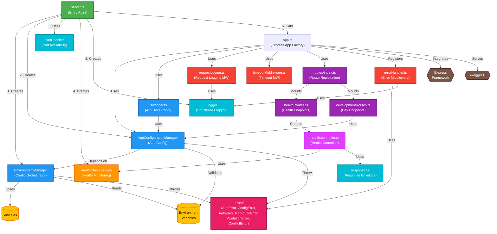
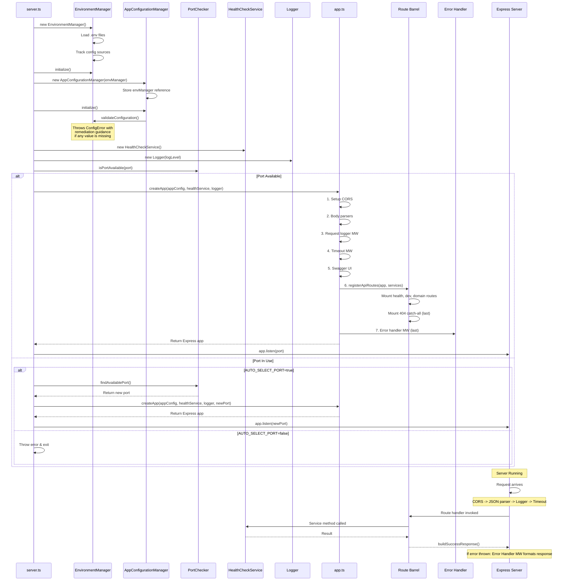

# Design Draft: API Base Skill Update -- Complete Code Specifications

**Date**: 2026-02-23
**Purpose**: Exact TypeScript code and markdown content for insertion into `01-model-api-option.md`
**Source investigation**: `api-base-skill-update/01-investigation-notes.md`
**Implementation plan**: `api-base-skill-update/02-implementation-plan.md`

---

## Table of Contents

1. [Feature 0: Foundation (New Types and Utilities)](#feature-0-foundation)
2. [Feature 1: Granular Error Handling](#feature-1-granular-error-handling)
3. [Feature 2: Request Logging Middleware](#feature-2-request-logging-middleware)
4. [Feature 3: Timeout Middleware](#feature-3-timeout-middleware)
5. [Feature 4: Detailed Config Error Messages](#feature-4-detailed-config-error-messages)
6. [Feature 5: Controller Separation](#feature-5-controller-separation)
7. [Cross-Cutting Updates](#cross-cutting-updates)

---

## Feature 0: Foundation

This feature introduces the error hierarchy, logger utility, and response envelope utilities that all other features depend on.

### F0-1: `src/errors/AppError.ts` -- Base Error Class

```typescript
/**
 * Base application error class.
 * All domain errors extend this class. Provides:
 * - `code`: machine-readable error identifier (e.g., "RESOURCE_NOT_FOUND")
 * - `statusCode`: optional HTTP status hint used by the error handler middleware
 * - `details`: optional structured data for client-safe error context
 * - `toJSON()`: serializes the error to the standard error envelope shape
 *
 * IMPORTANT: Object.setPrototypeOf ensures `instanceof` works correctly
 * with TypeScript class inheritance across compilation targets.
 */
export class AppError extends Error {
  constructor(
    public readonly code: string,
    message: string,
    public readonly statusCode?: number,
    public readonly details?: unknown,
  ) {
    super(message);
    this.name = this.constructor.name;
    Object.setPrototypeOf(this, new.target.prototype);
  }

  toJSON(): { code: string; message: string; details?: unknown } {
    return {
      code: this.code,
      message: this.message,
      ...(this.details !== undefined ? { details: this.details } : {}),
    };
  }
}
```

### F0-2: `src/errors/ConfigError.ts` -- Configuration Error

```typescript
import { AppError } from './AppError';

/**
 * Configuration error with factory methods that generate remediation guidance.
 * The error handler middleware sanitizes ConfigError messages (they may contain
 * file paths, env var names, or internal structure hints).
 *
 * Factory methods:
 * - missingRequired(): generates multi-line message showing how to provide the value
 * - invalidValue(): shows the invalid value and optionally the allowed values
 */
export class ConfigError extends AppError {
  constructor(code: string, message: string, details?: unknown) {
    super(code, message, undefined, details);
  }

  /**
   * Creates a ConfigError for a missing required configuration parameter.
   * The message includes concrete remediation steps showing how to provide the
   * value via environment variable and config file (.env).
   *
   * @param paramName    - The configuration parameter name (e.g., "PORT")
   * @param envVarHint   - Example command to set via env var (e.g., "export PORT=3000")
   * @param configFileHint - Guidance for setting in .env file (e.g., "(set PORT in your .env file)")
   * @param initCommandHint - Optional command to auto-generate config (e.g., "my-app config init")
   */
  static missingRequired(
    paramName: string,
    envVarHint: string,
    configFileHint: string,
    initCommandHint?: string,
  ): ConfigError {
    let message =
      `Missing required configuration: ${paramName}\n\n` +
      `Provide it via one of the following methods:\n` +
      `  - Environment var:   ${envVarHint}\n` +
      `  - Config file:       ${configFileHint}\n`;

    if (initCommandHint) {
      message += `\nRun '${initCommandHint}' to create a configuration file interactively.`;
    }

    return new ConfigError('CONFIG_MISSING_REQUIRED', message, { paramName });
  }

  /**
   * Creates a ConfigError for an invalid configuration value.
   * Includes the rejected value and optionally the set of allowed values.
   *
   * @param paramName     - The configuration parameter name
   * @param value         - The invalid value that was provided
   * @param allowedValues - Optional list of allowed values or descriptions
   */
  static invalidValue(
    paramName: string,
    value: unknown,
    allowedValues?: string[],
  ): ConfigError {
    let message = `Invalid configuration value for ${paramName}: "${value}"`;
    if (allowedValues && allowedValues.length > 0) {
      message += `\nAllowed values: ${allowedValues.join(', ')}`;
    }
    return new ConfigError('CONFIG_INVALID_VALUE', message, {
      paramName,
      value,
      allowedValues,
    });
  }
}
```

### F0-3: `src/errors/NotFoundError.ts` -- Resource Not Found Error

```typescript
import { AppError } from './AppError';

/**
 * Error thrown when a requested resource does not exist.
 * Maps to HTTP 404.
 *
 * @param resourceType - The type of resource (e.g., "User", "File", "Order")
 * @param identifier   - The identifier that was not found (e.g., "user-123", "/docs/readme.md")
 */
export class NotFoundError extends AppError {
  constructor(resourceType: string, identifier: string) {
    super(
      'RESOURCE_NOT_FOUND',
      `${resourceType} not found: ${identifier}`,
      404,
      { resourceType, identifier },
    );
  }
}
```

### F0-4: `src/errors/ValidationError.ts` -- Input Validation Error

```typescript
import { AppError } from './AppError';

/**
 * Error thrown when request input fails validation.
 * Maps to HTTP 400. Use for path validation, request body validation,
 * metadata limits, query parameter errors, etc.
 *
 * @param message - Human-readable description of the validation failure
 * @param details - Optional structured data about what failed validation
 */
export class ValidationError extends AppError {
  constructor(message: string, details?: unknown) {
    super('VALIDATION_ERROR', message, 400, details);
  }
}
```

### F0-5: `src/errors/AuthError.ts` -- Authentication/Authorization Error

```typescript
import { AppError } from './AppError';

/**
 * Error for authentication and authorization failures.
 * The error handler middleware sanitizes most AuthError messages to prevent
 * leaking which auth method is configured or which credentials are missing.
 *
 * Only AUTH_ACCESS_DENIED and AUTH_CONNECTION_FAILED keep their original
 * messages (they are client-safe).
 *
 * Factory methods:
 * - accessDenied(): 403 -- the caller lacks permission
 * - connectionFailed(): 502 -- cannot reach the auth provider
 */
export class AuthError extends AppError {
  constructor(code: string, message: string, details?: unknown) {
    super(code, message, 500, details);
  }

  /**
   * The caller's credentials are valid but they lack permission for the operation.
   * Maps to HTTP 403.
   */
  static accessDenied(message?: string): AuthError {
    return new AuthError(
      'AUTH_ACCESS_DENIED',
      message || 'Access denied. Check your credentials and permissions.',
    );
  }

  /**
   * Cannot connect to the authentication provider or backend service.
   * Maps to HTTP 502.
   */
  static connectionFailed(originalError?: Error): AuthError {
    return new AuthError(
      'AUTH_CONNECTION_FAILED',
      'Failed to connect to the authentication provider.',
      originalError ? { originalMessage: originalError.message } : undefined,
    );
  }
}
```

### F0-6: `src/errors/ConflictError.ts` -- Conflict/Concurrency Error

```typescript
import { AppError } from './AppError';

/**
 * Error for concurrency conflicts and resource state conflicts.
 * Maps to HTTP 409 by default. Use HTTP 412 for ETag-based precondition failures
 * by passing statusCode 412 in the details or using a subclass.
 *
 * @param message - Description of the conflict (e.g., "Resource was modified by another process")
 * @param details - Optional structured data (e.g., expected vs actual ETag)
 */
export class ConflictError extends AppError {
  constructor(message: string, details?: unknown) {
    super('CONFLICT', message, 409, details);
  }
}
```

### F0-7: `src/errors/index.ts` -- Barrel Export

```typescript
export { AppError } from './AppError';
export { ConfigError } from './ConfigError';
export { AuthError } from './AuthError';
export { NotFoundError } from './NotFoundError';
export { ValidationError } from './ValidationError';
export { ConflictError } from './ConflictError';
```

### F0-8: `src/utils/logger.ts` -- Logger Utility

```typescript
/**
 * Lightweight level-based logger that writes to stderr.
 *
 * Why stderr? Keeps stdout clean for structured JSON output (important when
 * the API output is consumed by other tools or piped).
 *
 * Log format: [ISO-TIMESTAMP] [LEVEL] message {"contextKey":"contextValue"}
 * Example:    [2026-02-23T12:00:00.000Z] [INFO] GET /health -> 200 (12ms)
 *
 * The Logger is injected via constructor parameters (not a global singleton)
 * to support testing and multiple logger instances with different levels.
 */

export type LogLevel = 'debug' | 'info' | 'warn' | 'error';

const LOG_LEVEL_VALUES: Record<LogLevel, number> = {
  debug: 0,
  info: 1,
  warn: 2,
  error: 3,
};

export class Logger {
  private levelValue: number;

  constructor(private level: LogLevel = 'info') {
    this.levelValue = LOG_LEVEL_VALUES[level];
  }

  debug(message: string, context?: Record<string, unknown>): void {
    this.log('debug', message, context);
  }

  info(message: string, context?: Record<string, unknown>): void {
    this.log('info', message, context);
  }

  warn(message: string, context?: Record<string, unknown>): void {
    this.log('warn', message, context);
  }

  error(message: string, context?: Record<string, unknown>): void {
    this.log('error', message, context);
  }

  private log(level: LogLevel, message: string, context?: Record<string, unknown>): void {
    if (LOG_LEVEL_VALUES[level] < this.levelValue) return;
    const timestamp = new Date().toISOString();
    const contextStr = context ? ' ' + JSON.stringify(context) : '';
    process.stderr.write(
      `[${timestamp}] [${level.toUpperCase()}] ${message}${contextStr}\n`,
    );
  }
}

/**
 * A logger that discards all output. Useful for:
 * - Pre-configuration scenarios (before config is loaded)
 * - Unit tests that don't want log noise
 */
export class NullLogger extends Logger {
  constructor() {
    super('error');
  }
  debug(): void {}
  info(): void {}
  warn(): void {}
  error(): void {}
}
```

### F0-9: `src/types/api.types.ts` -- Response Envelope Types

```typescript
/**
 * Standardized API response envelope types.
 *
 * ALL responses (success, error, 404, timeout) follow one of two shapes.
 * This ensures consumers can reliably parse responses by checking `success`.
 *
 * Success: { success: true,  data: T,     metadata: { command, timestamp, durationMs } }
 * Error:   { success: false, error: {...}, metadata: { timestamp } }
 */

export interface SuccessResponse<T> {
  success: true;
  data: T;
  metadata: {
    command: string;
    timestamp: string;
    durationMs: number;
  };
}

export interface ErrorResponseBody {
  code: string;
  message: string;
  details?: unknown;
}

export interface ErrorResponse {
  success: false;
  error: ErrorResponseBody;
  metadata: {
    timestamp: string;
  };
}

export type ApiResponse<T> = SuccessResponse<T> | ErrorResponse;
```

### F0-10: `src/utils/response.ts` -- Response Envelope Builders

```typescript
import { SuccessResponse, ErrorResponse } from '../types/api.types';

/**
 * Builds a standardized success response envelope.
 *
 * @param command   - Operation identifier (e.g., "api:health", "api:users:create")
 * @param data      - The response payload
 * @param startTime - Value from Date.now() captured at the start of the request handler
 *
 * @example
 * ```typescript
 * async function getUser(req: Request, res: Response): Promise<void> {
 *   const startTime = Date.now();
 *   const user = await userService.findById(req.params.id);
 *   res.json(buildSuccessResponse('api:users:get', user, startTime));
 * }
 * ```
 */
export function buildSuccessResponse<T>(
  command: string,
  data: T,
  startTime: number,
): SuccessResponse<T> {
  return {
    success: true,
    data,
    metadata: {
      command,
      timestamp: new Date().toISOString(),
      durationMs: Date.now() - startTime,
    },
  };
}

/**
 * Builds a standardized error response envelope.
 * Primarily used by middleware (error handler, timeout, 404 catch-all).
 * Controllers should throw errors and let the error handler format the response.
 *
 * @param code    - Machine-readable error code (e.g., "NOT_FOUND", "VALIDATION_ERROR")
 * @param message - Human-readable error description
 * @param details - Optional structured data about the error
 */
export function buildErrorResponse(
  code: string,
  message: string,
  details?: unknown,
): ErrorResponse {
  return {
    success: false,
    error: {
      code,
      message,
      ...(details !== undefined ? { details } : {}),
    },
    metadata: {
      timestamp: new Date().toISOString(),
    },
  };
}
```

### F0-11: New Environment Variable

Add `LOG_LEVEL` to the "Required Environment Variables" section:

```bash
# Logging
LOG_LEVEL                   # Log level: debug, info, warn, error
```

---

## Feature 1: Granular Error Handling

### F1-1: `src/middleware/errorHandler.ts` -- Error Handler Middleware

This replaces the current Section 9 ("Create Error Handler") in the skill file.

```typescript
import { Request, Response, NextFunction } from 'express';
import { AppError } from '../errors/AppError';
import { ConfigError } from '../errors/ConfigError';
import { AuthError } from '../errors/AuthError';
import { Logger } from '../utils/logger';

/**
 * Maps application error types to HTTP status codes.
 *
 * The mapping uses `instanceof` checks in a priority chain.
 * ConfigError and AuthError have special handling because their
 * status codes depend on context (e.g., AUTH_ACCESS_DENIED = 403).
 *
 * Extend this function when you add new AppError subclasses to your project.
 * The final fallback reads `err.statusCode` (if the error class embedded one)
 * or defaults to 500.
 */
function mapErrorToHttpStatus(err: AppError): number {
  // ConfigError: always 500 (server-side issue, message is sanitized)
  if (err instanceof ConfigError) return 500;

  // AuthError: depends on the specific auth failure
  if (err instanceof AuthError) {
    switch (err.code) {
      case 'AUTH_ACCESS_DENIED':
        return 403;
      case 'AUTH_CONNECTION_FAILED':
        return 502;
      default:
        return 500;
    }
  }

  // All other AppError subclasses: use the embedded statusCode hint or 500
  // NotFoundError -> 404, ValidationError -> 400, ConflictError -> 409, etc.
  return err.statusCode || 500;
}

/**
 * Returns a sanitized message for errors that may leak server internals.
 * Returns null if the original message is safe to forward to the client.
 *
 * ConfigError messages may contain file paths, env var names, or internal
 * structure hints. AuthError messages for missing credentials may reveal
 * which auth method is configured. These are replaced with generic messages.
 *
 * Client-facing errors (not found, validation, conflict) keep their
 * original detailed messages.
 */
function getSanitizedMessage(err: AppError): string | null {
  if (err instanceof ConfigError) {
    return 'Server configuration error. Contact the administrator.';
  }
  if (err instanceof AuthError) {
    // ACCESS_DENIED and CONNECTION_FAILED are client-safe
    if (err.code === 'AUTH_ACCESS_DENIED' || err.code === 'AUTH_CONNECTION_FAILED') {
      return null;
    }
    // Other auth errors (missing credentials, expired tokens) are sanitized
    return 'Server authentication error. Contact the administrator.';
  }
  return null; // domain errors keep their original messages
}

/**
 * Factory function that creates the centralized error handler middleware.
 *
 * MUST be registered LAST in the middleware chain (Express 4-arg error signature).
 *
 * Handles three categories of errors:
 * 1. AppError subclasses (known errors) -- mapped to appropriate HTTP status codes
 * 2. MulterError (file upload errors)   -- 413 for file-too-large, 400 for other upload errors
 * 3. Unknown errors (unexpected)        -- generic 500 with no details leaked
 *
 * All error responses use the standardized envelope:
 * { success: false, error: { code, message, details? }, metadata: { timestamp } }
 *
 * @param logger - Logger instance for recording error details server-side
 */
export function createErrorHandlerMiddleware(logger: Logger) {
  return function errorHandlerMiddleware(
    err: unknown,
    _req: Request,
    res: Response,
    _next: NextFunction,
  ): void {
    const timestamp = new Date().toISOString();

    // --- AppError subclasses (known application errors) ---
    if (err instanceof AppError) {
      const httpStatus = mapErrorToHttpStatus(err);
      const sanitizedMessage = getSanitizedMessage(err);

      logger.error(`[${err.code}] ${err.message}`, {
        code: err.code,
        httpStatus,
        ...(err.details ? { details: err.details as Record<string, unknown> } : {}),
      });

      const errorBody = sanitizedMessage
        ? { code: err.code, message: sanitizedMessage }
        : err.toJSON();

      res.status(httpStatus).json({
        success: false,
        error: errorBody,
        metadata: { timestamp },
      });
      return;
    }

    // --- MulterError (file upload errors, if using multer) ---
    // Uses duck-typing so it works without multer installed.
    // If multer is not used, this branch is never reached.
    if (
      err &&
      typeof err === 'object' &&
      'name' in err &&
      (err as { name: string }).name === 'MulterError'
    ) {
      const multerErr = err as unknown as {
        code: string;
        message: string;
        field?: string;
      };
      logger.error(`MulterError: ${multerErr.code} - ${multerErr.message}`, {
        code: multerErr.code,
        field: multerErr.field,
      });

      const httpStatus = multerErr.code === 'LIMIT_FILE_SIZE' ? 413 : 400;
      const errorCode =
        multerErr.code === 'LIMIT_FILE_SIZE'
          ? 'UPLOAD_FILE_TOO_LARGE'
          : 'UPLOAD_ERROR';

      res.status(httpStatus).json({
        success: false,
        error: { code: errorCode, message: multerErr.message },
        metadata: { timestamp },
      });
      return;
    }

    // --- Unknown errors (unexpected) ---
    // Never leak stack traces or internal details to the client.
    const errorMessage = err instanceof Error ? err.message : String(err);
    const errorStack = err instanceof Error ? err.stack : undefined;
    logger.error(`Unhandled error: ${errorMessage}`, {
      ...(errorStack ? { stack: errorStack } : {}),
    });

    res.status(500).json({
      success: false,
      error: {
        code: 'INTERNAL_ERROR',
        message: 'An internal server error occurred.',
      },
      metadata: { timestamp },
    });
  };
}
```

---

## Feature 2: Request Logging Middleware

### F2-1: `src/middleware/requestLogger.ts` -- Request Logging Middleware

```typescript
import { Request, Response, NextFunction } from 'express';
import { Logger } from '../utils/logger';

/**
 * Factory function that creates request logging middleware.
 *
 * Logs every completed request in the format:
 *   METHOD URL -> STATUS (DURATIONms)
 * Example:
 *   GET /api/v1/users/123 -> 200 (42ms)
 *
 * Design decisions:
 * - Uses `res.on('finish')` for accurate timing (measures full response lifecycle)
 * - Never logs request bodies, response bodies, or headers (privacy by design)
 * - Writes to stderr via Logger (keeps stdout clean for structured output)
 * - Registration order: AFTER body parsers, BEFORE timeout middleware
 *
 * @param logger - Logger instance for writing request log entries
 */
export function createRequestLoggerMiddleware(logger: Logger) {
  return function requestLoggerMiddleware(
    req: Request,
    res: Response,
    next: NextFunction,
  ): void {
    const startTime = Date.now();

    res.on('finish', () => {
      const durationMs = Date.now() - startTime;
      logger.info(
        `${req.method} ${req.originalUrl} -> ${res.statusCode} (${durationMs}ms)`,
      );
    });

    next();
  };
}
```

---

## Feature 3: Timeout Middleware

### F3-1: `src/middleware/timeoutMiddleware.ts` -- Timeout Middleware

```typescript
import { Request, Response, NextFunction } from 'express';

/**
 * Factory function that creates per-request timeout middleware.
 *
 * If the handler does not complete within `timeoutMs`, sends HTTP 408 Request Timeout
 * with the standardized error envelope. The timer is cleaned up when the response
 * finishes normally or when the client disconnects.
 *
 * Design decisions:
 * - Guards with `!res.headersSent` to prevent writing after response is already sent
 * - Cleans up on both 'finish' (normal completion) and 'close' (client disconnect)
 * - Does NOT abort the underlying handler -- the handler may continue running but
 *   the client receives a fast failure signal
 * - The timeout value should come from validated configuration (e.g., API_TIMEOUT env var)
 *
 * @param timeoutMs - Maximum time in milliseconds before sending 408
 */
export function createTimeoutMiddleware(timeoutMs: number) {
  return function timeoutMiddleware(
    _req: Request,
    res: Response,
    next: NextFunction,
  ): void {
    const timer = setTimeout(() => {
      if (!res.headersSent) {
        res.status(408).json({
          success: false,
          error: {
            code: 'REQUEST_TIMEOUT',
            message: `Request timed out after ${timeoutMs}ms.`,
          },
          metadata: {
            timestamp: new Date().toISOString(),
          },
        });
      }
    }, timeoutMs);

    // Clear the timer when the response finishes normally
    res.on('finish', () => clearTimeout(timer));

    // Also clear on close (client disconnect)
    res.on('close', () => clearTimeout(timer));

    next();
  };
}
```

---

## Feature 4: Detailed Config Error Messages

This feature modifies existing classes to use `ConfigError` instead of plain `Error`.

### F4-1: Updated `EnvironmentManager.validateConfiguration()`

Replace the entire `validateConfiguration()` method in `src/config/EnvironmentManager.ts`.

**Add import at the top of the file:**

```typescript
import { ConfigError } from '../errors/ConfigError';
```

**New method body:**

```typescript
  validateConfiguration(): void {
    // Each required variable is validated individually with detailed
    // remediation guidance showing how to provide the missing value.

    if (!process.env.NODE_ENV) {
      throw ConfigError.missingRequired(
        'NODE_ENV',
        'export NODE_ENV=development',
        '(set NODE_ENV in your .env file)',
      );
    }

    if (!process.env.PORT) {
      throw ConfigError.missingRequired(
        'PORT',
        'export PORT=3000',
        '(set PORT in your .env file)',
      );
    }

    if (!process.env.HOST) {
      throw ConfigError.missingRequired(
        'HOST',
        'export HOST=localhost',
        '(set HOST in your .env file)',
      );
    }

    if (!process.env.CORS_ORIGIN) {
      throw ConfigError.missingRequired(
        'CORS_ORIGIN',
        'export CORS_ORIGIN=http://localhost:3000',
        '(set CORS_ORIGIN in your .env file)',
      );
    }

    // Validate PORT range
    const port = parseInt(process.env.PORT!, 10);
    if (isNaN(port) || port < 1 || port > 65535) {
      throw ConfigError.invalidValue('PORT', process.env.PORT, [
        'integer between 1 and 65535',
      ]);
    }

    // Validate LOG_LEVEL if provided
    if (process.env.LOG_LEVEL) {
      const validLevels = ['debug', 'info', 'warn', 'error'];
      if (!validLevels.includes(process.env.LOG_LEVEL)) {
        throw ConfigError.invalidValue('LOG_LEVEL', process.env.LOG_LEVEL, validLevels);
      }
    }

    console.log(chalk.green('  Configuration validated successfully'));
  }
```

### F4-2: Updated `AppConfigurationManager.validateRequiredConfigs()`

Replace the `validateRequiredConfigs()` method and `getApiConfig()` method in `src/config/AppConfigurationManager.ts`.

**Add import at the top of the file:**

```typescript
import { ConfigError } from '../errors/ConfigError';
```

**New `validateRequiredConfigs()` method:**

```typescript
  private validateRequiredConfigs(): void {
    // API_TIMEOUT is required (no defaults)
    if (!process.env.API_TIMEOUT) {
      throw ConfigError.missingRequired(
        'API_TIMEOUT',
        'export API_TIMEOUT=30000',
        '(set API_TIMEOUT in your .env file)',
      );
    }

    const apiTimeout = parseInt(process.env.API_TIMEOUT, 10);
    if (isNaN(apiTimeout) || apiTimeout < 1000) {
      throw ConfigError.invalidValue('API_TIMEOUT', process.env.API_TIMEOUT, [
        'integer >= 1000 (milliseconds)',
      ]);
    }

    // API_MAX_REQUEST_SIZE is required (no defaults)
    if (!process.env.API_MAX_REQUEST_SIZE) {
      throw ConfigError.missingRequired(
        'API_MAX_REQUEST_SIZE',
        'export API_MAX_REQUEST_SIZE=10mb',
        '(set API_MAX_REQUEST_SIZE in your .env file)',
      );
    }

    // API_RATE_LIMIT_PER_MINUTE is required (no defaults)
    if (!process.env.API_RATE_LIMIT_PER_MINUTE) {
      throw ConfigError.missingRequired(
        'API_RATE_LIMIT_PER_MINUTE',
        'export API_RATE_LIMIT_PER_MINUTE=100',
        '(set API_RATE_LIMIT_PER_MINUTE in your .env file)',
      );
    }

    const rateLimit = parseInt(process.env.API_RATE_LIMIT_PER_MINUTE, 10);
    if (isNaN(rateLimit) || rateLimit < 1) {
      throw ConfigError.invalidValue('API_RATE_LIMIT_PER_MINUTE', process.env.API_RATE_LIMIT_PER_MINUTE, [
        'integer >= 1',
      ]);
    }
  }
```

**New `getApiConfig()` method (no defaults):**

```typescript
  getApiConfig() {
    return {
      timeout: parseInt(process.env.API_TIMEOUT!, 10),
      maxRequestSize: process.env.API_MAX_REQUEST_SIZE!,
      rateLimitPerMinute: parseInt(process.env.API_RATE_LIMIT_PER_MINUTE!, 10),
    };
  }
```

---

## Feature 5: Controller Separation

### F5-1: `src/controllers/health.controller.ts` -- Health Controller

```typescript
import { Request, Response } from 'express';
import { HealthCheckService } from '../services/HealthCheckService';
import { buildSuccessResponse } from '../utils/response';

/**
 * Factory function that creates the health check controller.
 *
 * Controllers are thin adapters between HTTP and services:
 * 1. Extract parameters from the request
 * 2. Call the appropriate service method
 * 3. Format the response using the standardized envelope
 *
 * Controllers do NOT contain try/catch blocks. Express 5.x automatically
 * forwards async errors to the error handler middleware.
 *
 * @param healthService - The health check service instance
 */
export function createHealthController(healthService: HealthCheckService) {
  return {
    /**
     * GET /health
     * Returns the health status of the application.
     * Returns 200 if healthy, 503 if unhealthy.
     */
    async checkHealth(_req: Request, res: Response): Promise<void> {
      const startTime = Date.now();
      const health = await healthService.checkHealth();
      const statusCode = health.status === 'healthy' ? 200 : 503;
      res.status(statusCode).json(
        buildSuccessResponse('api:health', health, startTime),
      );
    },
  };
}
```

### F5-2: Updated `src/routes/healthRoutes.ts` -- Health Routes Using Controller

```typescript
import { Router } from 'express';
import { HealthCheckService } from '../services/HealthCheckService';
import { createHealthController } from '../controllers/health.controller';

/**
 * Creates the health check route group.
 * Delegates all request handling to the health controller.
 *
 * With Express 5.x, async errors in controller methods are automatically
 * forwarded to the error handler middleware (no try/catch needed).
 *
 * @param healthService - The health check service instance
 */
export default function healthRoutes(healthService: HealthCheckService): Router {
  const router = Router();
  const controller = createHealthController(healthService);

  /**
   * @swagger
   * /health:
   *   get:
   *     summary: Health check endpoint
   *     tags:
   *       - Health
   *     responses:
   *       200:
   *         description: Service is healthy
   *         content:
   *           application/json:
   *             schema:
   *               type: object
   *               properties:
   *                 success:
   *                   type: boolean
   *                 data:
   *                   type: object
   *                   properties:
   *                     status:
   *                       type: string
   *                       enum: [healthy, unhealthy]
   *                     timestamp:
   *                       type: string
   *                       format: date-time
   *                     checks:
   *                       type: object
   *                       properties:
   *                         configuration:
   *                           type: boolean
   *                         server:
   *                           type: boolean
   *                 metadata:
   *                   type: object
   *                   properties:
   *                     command:
   *                       type: string
   *                     timestamp:
   *                       type: string
   *                       format: date-time
   *                     durationMs:
   *                       type: number
   *             example:
   *               success: false
   *               data:
   *                 status: "string"
   *                 timestamp: "string"
   *                 checks:
   *                   configuration: false
   *                   server: false
   *                 details:
   *                   environment: "string"
   *                   version: "string"
   *                   uptime: 0
   *               metadata:
   *                 command: "string"
   *                 timestamp: "string"
   *                 durationMs: 0
   *       503:
   *         description: Service is unhealthy
   *         content:
   *           application/json:
   *             example:
   *               success: false
   *               error:
   *                 code: "string"
   *                 message: "string"
   *               metadata:
   *                 timestamp: "string"
   */
  router.get('/', controller.checkHealth);

  return router;
}
```

### F5-3: `src/routes/index.ts` -- Route Registration Barrel

```typescript
import { Express, Request, Response } from 'express';
import { AppConfigurationManager } from '../config/AppConfigurationManager';
import { HealthCheckService } from '../services/HealthCheckService';
import healthRoutes from './healthRoutes';
import { createDevelopmentRoutes } from './developmentRoutes';

/**
 * Aggregates all service dependencies needed by route modules.
 * Extend this interface as you add domain services to your project.
 */
export interface ApiServices {
  appConfigManager: AppConfigurationManager;
  healthService: HealthCheckService;
  // Add your domain services here as the project grows:
  // userService: UserService;
  // orderService: OrderService;
}

/**
 * Registers all API routes on the Express app.
 *
 * Route groups are mounted in this order:
 * 1. Health check routes
 * 2. Feature flags endpoint
 * 3. Domain API routes (add yours here)
 * 4. Development-only routes (gated by NODE_ENV)
 * 5. 404 catch-all (MUST be last)
 *
 * @param app      - The Express application instance
 * @param services - All service dependencies needed by route handlers
 */
export function registerApiRoutes(app: Express, services: ApiServices): void {
  // Health check
  app.use('/health', healthRoutes(services.healthService));

  // Feature flags
  app.get('/api/config/features', (_req, res) => {
    res.json(services.appConfigManager.getFeatureFlags());
  });

  // --- Add your API route groups here ---
  // app.use('/api/v1/users', createUserRoutes(services.userService));
  // app.use('/api/v1/orders', createOrderRoutes(services.orderService));

  // Development-only routes
  if (process.env.NODE_ENV === 'development') {
    app.use('/api/dev', createDevelopmentRoutes(services.appConfigManager));
  }

  // 404 catch-all (MUST be the last route registered)
  app.use((_req: Request, res: Response) => {
    res.status(404).json({
      success: false,
      error: {
        code: 'NOT_FOUND',
        message: `Route not found: ${_req.method} ${_req.originalUrl}`,
      },
      metadata: {
        timestamp: new Date().toISOString(),
      },
    });
  });
}
```

---

## Cross-Cutting Updates

### CX-1: Updated `src/app.ts` -- Express App Factory

```typescript
import express, { Express } from 'express';
import cors from 'cors';
import swaggerUi from 'swagger-ui-express';
import { AppConfigurationManager } from './config/AppConfigurationManager';
import { HealthCheckService } from './services/HealthCheckService';
import { createSwaggerSpec } from './config/swagger';
import { Logger } from './utils/logger';
import { createRequestLoggerMiddleware } from './middleware/requestLogger';
import { createTimeoutMiddleware } from './middleware/timeoutMiddleware';
import { createErrorHandlerMiddleware } from './middleware/errorHandler';
import { ApiServices, registerApiRoutes } from './routes/index';

/**
 * Pure factory function that creates and configures the Express application.
 * Has no side effects (no listening, no process signals) -- fully testable.
 *
 * Middleware registration order (CRITICAL -- do not reorder):
 * 1. CORS         -- Handles OPTIONS preflight before any other processing
 * 2. Body parsers -- express.json() and express.urlencoded()
 * 3. Request logger -- Captures timing from this point forward
 * 4. Timeout      -- Starts the per-request timer
 * 5. Swagger UI   -- API documentation (before routes)
 * 6. Routes       -- Application routes (includes 404 catch-all as last route)
 * 7. Error handler -- MUST be last (Express 4-arg error signature)
 *
 * @param appConfigManager - Validated application configuration
 * @param healthService    - Health check service instance
 * @param logger           - Logger instance for middleware
 * @param actualPort       - Actual port (if different from configured, e.g., after port conflict resolution)
 */
export function createApp(
  appConfigManager: AppConfigurationManager,
  healthService: HealthCheckService,
  logger: Logger,
  actualPort?: number,
): Express {
  const app = express();

  // 1. CORS (must be first for preflight handling)
  const corsOptions = {
    origin: (origin: string | undefined, callback: Function) => {
      const allowedOrigins = appConfigManager.getCorsOrigins();
      if (!origin || allowedOrigins.includes('*') || allowedOrigins.includes(origin)) {
        callback(null, true);
      } else {
        callback(new Error('Not allowed by CORS'));
      }
    },
    credentials: true,
  };
  app.use(cors(corsOptions));

  // 2. Body parsers
  app.use(express.json({ limit: appConfigManager.getApiConfig().maxRequestSize }));
  app.use(express.urlencoded({ extended: true }));

  // 3. Request logging
  app.use(createRequestLoggerMiddleware(logger));

  // 4. Timeout
  app.use(createTimeoutMiddleware(appConfigManager.getApiConfig().timeout));

  // 5. API Documentation (Swagger)
  const swaggerSpec = createSwaggerSpec(appConfigManager, actualPort);
  app.use('/api-docs', swaggerUi.serve, swaggerUi.setup(swaggerSpec));
  app.get('/api/swagger.json', (_req, res) => {
    res.setHeader('Content-Type', 'application/json');
    res.send(swaggerSpec);
  });

  // 6. Routes (includes 404 catch-all at end)
  const services: ApiServices = {
    appConfigManager,
    healthService,
  };
  registerApiRoutes(app, services);

  // 7. Error handler (MUST be last -- Express 4-arg error signature)
  app.use(createErrorHandlerMiddleware(logger));

  return app;
}
```

### CX-2: Updated `src/server.ts` -- Server Entry Point

Changes to the existing `startServer()` function. Only the modified lines are shown with context.

**Add imports at the top:**

```typescript
import { Logger, LogLevel } from './utils/logger';
```

**After "Step 3: Validate configuration" (after `envManager.printConfigSources()`), add Logger instantiation:**

```typescript
    // Step 3.5: Initialize logger
    const logLevel = (process.env.LOG_LEVEL || 'info') as LogLevel;
    const logger = new Logger(logLevel);
```

**Update all `createApp()` calls to pass the logger:**

```typescript
    // Where createApp is called without port override:
    const app = createApp(appConfigManager, healthService, logger);

    // Where createApp is called with port override (in the auto-select-port branch):
    const app = createApp(appConfigManager, healthService, logger, newPort);
```

**Note**: The `LOG_LEVEL` env var is the one exception to the no-defaults rule (it defaults to `'info'`). This exception exists because logging must work before configuration validation runs. This exception must be recorded in the project's memory file before implementation.

### CX-3: Updated Project Directory Structure

Replace the current `mkdir` command:

```bash
# Create project structure
mkdir -p src/{config,controllers,errors,middleware,routes,services,types,utils}
```

The `errors/` and `controllers/` directories are now explicit first-class components.

### CX-4: Updated Module Architecture Diagram (Mermaid)



### CX-5: Updated Module Invocation Sequence (Mermaid)



### CX-6: Updated Module Responsibilities Table

| Module | Type | Responsibility | Dependencies |
|--------|------|---------------|--------------|
| **server.ts** | Entry Point | Application bootstrap, orchestrates initialization | All modules |
| **EnvironmentManager** | Config | Loads and tracks all configuration sources | dotenv, fs, ConfigError |
| **AppConfigurationManager** | Config | Validates and provides typed config access | EnvironmentManager, ConfigError |
| **swagger.ts** | Config | Generates OpenAPI specification | AppConfigurationManager |
| **app.ts** | Core | Creates and configures Express application | Express, all middleware, route barrel |
| **errors/** | Error | Typed error hierarchy with factory methods | None |
| **Logger** | Utility | Level-based structured logging to stderr | None |
| **response.ts** | Utility | Success/error response envelope builders | api.types |
| **HealthCheckService** | Service | Provides health status information | None |
| **health.controller.ts** | Controller | Health check request/response adapter | HealthCheckService, response.ts |
| **routes/index.ts** | Route | Centralized route registration barrel | All route modules |
| **healthRoutes.ts** | Route | Health check endpoint wiring | health.controller |
| **developmentRoutes.ts** | Route | Development-only debug endpoints | AppConfigurationManager |
| **errorHandler.ts** | Middleware | Centralized error handling with type-to-HTTP-status mapping, sanitization | Error hierarchy, Logger |
| **requestLogger.ts** | Middleware | Per-request timing and logging | Logger |
| **timeoutMiddleware.ts** | Middleware | Per-request timeout enforcement | None |
| **PortChecker** | Utility | Port availability checking and selection | net module |

### CX-7: Updated `.env` Example

Add the `LOG_LEVEL` variable to the `.env` and `.env.example` templates:

```bash
# Logging
LOG_LEVEL=info
```

### CX-8: Middleware Registration Order Documentation

Add this new subsection to the "Best Practices" section:

```markdown
### 7. Middleware Registration Order

The middleware chain MUST be registered in this exact order in `createApp()`:

1. **CORS** -- Handles OPTIONS preflight requests before any other processing
2. **Body parsers** -- `express.json()` and `express.urlencoded()`
3. **Request logger** -- Captures timing from this point forward
4. **Timeout** -- Starts the per-request timer (configurable via `API_TIMEOUT`)
5. **Swagger UI** -- API documentation (before routes so it is not caught by 404)
6. **Routes** -- Application routes via `registerApiRoutes()` (includes 404 catch-all as last route)
7. **Error handler** -- MUST be last (Express 4-arg signature detects error middleware)

Reordering middleware will break functionality:
- Moving CORS after body parsers: preflight requests fail
- Moving error handler before routes: errors bypass the handler
- Moving timeout after routes: timeout never fires
- Moving 404 catch-all before domain routes: all routes return 404
```

### CX-9: Updated Package.json Dependencies

No new npm packages are required. All five features use only Express and Node.js built-in modules. The existing dependencies remain unchanged:

- `express` -- HTTP framework
- `cors` -- CORS middleware
- `dotenv` -- Environment variable loading
- `chalk` -- Console output styling
- `swagger-jsdoc` -- OpenAPI spec generation
- `swagger-ui-express` -- Swagger UI serving

The `Logger` class is a custom utility (intentionally avoids adding `winston` or `pino` for what is a simple level-based stderr writer).

### CX-10: Updated `.env.example` Template

```bash
# Core Application Settings
NODE_ENV=
PORT=
HOST=
CORS_ORIGIN=

# Logging
LOG_LEVEL=

# Port conflict handling
AUTO_SELECT_PORT=

# API Configuration
API_TIMEOUT=
API_MAX_REQUEST_SIZE=
API_RATE_LIMIT_PER_MINUTE=

# Feature Flags
FEATURE_DARK_MODE=
FEATURE_BETA_UI=

# Container & Cloud Environment (Optional)
PUBLIC_URL=
DOCKER_HOST_URL=
SWAGGER_ADDITIONAL_SERVERS=
ENABLE_SERVER_VARIABLES=
USE_HTTPS=

# Azure-specific (Auto-populated by Azure App Service - DO NOT SET MANUALLY)
# WEBSITE_HOSTNAME=
# WEBSITE_SITE_NAME=

# Kubernetes-specific (Auto-populated by K8s - DO NOT SET MANUALLY)
# K8S_SERVICE_HOST=
# K8S_SERVICE_PORT=
```

---

## Section Number Mapping (Before -> After)

This table maps current section numbers in the skill file to their new positions:

| Current # | Current Title | New # | Action |
|-----------|--------------|-------|--------|
| 1 | Create Environment Manager | 1 | MODIFIED (validateConfiguration uses ConfigError) |
| 2 | Create App Configuration Manager | 2 | MODIFIED (validateRequiredConfigs uses ConfigError, getApiConfig no defaults) |
| 3 | Create Health Service | 3 | UNCHANGED |
| 4 | Create Express App | 4 | MODIFIED (new signature, middleware order, route barrel) |
| 5 | Create Swagger Configuration | 5 | UNCHANGED |
| -- | *(new)* Error Hierarchy | 6 | NEW (AppError + 5 subclasses + barrel) |
| -- | *(new)* Logger Utility | 7 | NEW (Logger + NullLogger) |
| -- | *(new)* Response Envelope Utilities | 8 | NEW (types + builders) |
| -- | *(new)* Controller Pattern | 9 | NEW (health.controller.ts) |
| 6 | Create Health Routes | 10 | MODIFIED (delegates to controller) |
| 7 | Create Development Routes | 11 | UNCHANGED |
| 8 | Update AppConfigurationManager | 12 | UNCHANGED |
| 9 | Create Error Handler | 13 | REPLACED (granular error handling middleware) |
| -- | *(new)* Create Request Logging Middleware | 14 | NEW |
| -- | *(new)* Create Timeout Middleware | 15 | NEW |
| -- | *(new)* Route Registration Barrel | 16 | NEW |
| 10 | Create Port Checker Utility | 17 | UNCHANGED |
| 11 | Create Server Entry Point | 18 | MODIFIED (Logger instantiation, updated createApp call) |
| 12 | Configure Package.json | 19 | UNCHANGED |

**Total new sections**: 7
**Total modified sections**: 5
**Total unchanged sections**: 7

---

## Complete File Inventory

### New Files (9 files)

| File | Feature | Lines (approx) |
|------|---------|----------------|
| `src/errors/AppError.ts` | F0 | 25 |
| `src/errors/ConfigError.ts` | F0 | 55 |
| `src/errors/NotFoundError.ts` | F0 | 15 |
| `src/errors/ValidationError.ts` | F0 | 12 |
| `src/errors/AuthError.ts` | F0 | 30 |
| `src/errors/ConflictError.ts` | F0 | 12 |
| `src/errors/index.ts` | F0 | 6 |
| `src/utils/logger.ts` | F0 | 55 |
| `src/types/api.types.ts` | F0 | 25 |
| `src/utils/response.ts` | F0 | 40 |
| `src/middleware/requestLogger.ts` | F2 | 25 |
| `src/middleware/timeoutMiddleware.ts` | F3 | 35 |
| `src/controllers/health.controller.ts` | F5 | 25 |
| `src/routes/index.ts` | F5 | 45 |

### Modified Files (5 files)

| File | Feature | Nature of Change |
|------|---------|-----------------|
| `src/config/EnvironmentManager.ts` | F4 | validateConfiguration() uses ConfigError |
| `src/config/AppConfigurationManager.ts` | F4 | validateRequiredConfigs() uses ConfigError, getApiConfig() no defaults |
| `src/middleware/errorHandler.ts` | F1 | Complete replacement with factory function + error hierarchy mapping |
| `src/routes/healthRoutes.ts` | F5 | Delegates to controller, uses response envelope |
| `src/app.ts` | CX | New signature, middleware order, route barrel |
| `src/server.ts` | CX | Logger instantiation, updated createApp() calls |

---

## Design Decisions Log

| Decision | Rationale |
|----------|-----------|
| `AppError` uses `Object.setPrototypeOf` | Ensures `instanceof` works correctly across TypeScript compilation targets |
| Error handler uses `instanceof` chain, not a Map | More readable, IDE-navigable, and handles the AuthError code-switching case naturally |
| ConfigError and AuthError are sanitized | These errors may leak internal paths, env var names, or auth configuration details |
| MulterError detection uses duck-typing | Works without multer installed; if multer is unused, the branch is never reached |
| Logger writes to stderr | Keeps stdout clean for structured JSON output (pipe-friendly) |
| Logger defaults to `'info'` level | Exception to no-defaults rule; logging must work before configuration validation |
| `buildSuccessResponse` is a shared utility | Avoids duplication across controllers (investigation found it copy-pasted per controller) |
| Controllers have no try/catch | Express 5.x automatically forwards async errors to the error handler middleware |
| 404 catch-all is in the route barrel | Guarantees it is registered after all routes, regardless of future route additions |
| No new npm dependencies | All features use Express built-ins and Node.js stdlib; Logger is intentionally custom |
| Response envelope always includes `success` boolean | Consumers can reliably branch on `response.success` without inspecting status codes |
